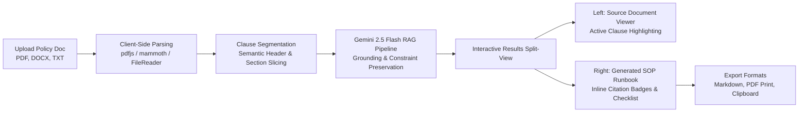

# Policy-to-Procedure Generator

[](https://react.dev/)
[](https://vitejs.dev/)
[](https://tailwindcss.com/)
[](https://ai.google.dev/)
[](https://firebase.google.com/)
[](https://aws.amazon.com/ec2/)

> **Enterprise-grade AI engine that transforms dense, ambiguous organizational compliance and security policies into clear, verifiable, and actionable Standard Operating Procedures (SOPs) and checklists with direct clause-level citations.**

---

## 📌 Executive Overview

Organizational policies (e.g., ISO 27001, SOC 2, HIPAA, internal IT governance) are typically written in legalistic, compliance-focused prose. Operational teams—such as sysadmins, customer support, and department managers—often struggle to translate these mandates into routine, reproducible workflows.

The **Policy-to-Procedure Generator** bridges this gap. By combining client-side document extraction with **Google Gemini RAG synthesis**, the platform ingests raw policy files (`.pdf`, `.docx`, `.txt`, `.md`), segments them into semantic clauses, and synthesizes step-by-step runbooks. Crucially, every single operational step remains strictly grounded with inline references (e.g., `[Sec 3.2]`) linked side-by-side with the original source document.

---

## 🏗️ Architecture & Pipeline



### 1. Document Ingestion & Extraction
- **PDF Extraction**: Processed in-browser using `pdfjs-dist` to extract structured page-by-page text without sending raw binary files to unvetted third-party storage.
- **Word (`.docx`)**: Parsed via `mammoth` into clean raw text structures.
- **Plain Text / Markdown**: Ingested via native `FileReader` API.
- **AST Clause Segmentation**: Automatically segments incoming policy text into numbered sections (`1.0`, `2.1`, etc.) to create addressable citation anchors.

### 2. Retrieval-Augmented Generation (RAG) & Synthesis
- **Model**: Powered by `@google/genai` utilizing `gemini-2.5-flash` with automatic fallback logic to `gemini-3.8-flash` for high-throughput availability.
- **Constraint Preservation**: Enforces zero hallucination guidelines. Every procedural step requires mandatory prerequisites, explicit actor roles, action substeps, compliance warnings, and strict inline citation badges (e.g. `[Sec 1.0]`, `[Sec 3.2]`).
- **Audience & Format Conditioning**: Prompts dynamically adapt tone, command depth, and structure based on target audience (e.g., SysAdmins vs. General Staff) and format (Step-by-Step SOP vs. Operational Checklist).

### 3. Synchronized Split-Pane Interface
- **Side-by-Side Comparison**: Displays the verified source document clauses on the left and the actionable operational procedure on the right.
- **Bi-directional Citation Anchors**: Clicking an inline citation badge (e.g., `[Sec 2.1]`) in the procedure automatically scrolls and illuminates the corresponding source clause in the document viewer.

---

## ✨ Key Features

- **Multi-Format Document Parsing**: Instant client-side ingestion of `.pdf`, `.docx`, `.txt`, and `.md` files.
- **Real-Time Pipeline Visualizer**: Animated live progress tracking across parsing, semantic chunking, clause retrieval, and synthesis phases.
- **Verifiable Source Grounding**: Complete transparency with active clause highlights and RAG grounding notes.
- **Dual Operating Modes**:
  - **Step-by-Step Runbooks**: Numbered procedural phases with assigned roles, operational tips, and compliance warnings.
  - **Interactive Checklist**: Dynamic state tracking for shift handovers and runbook execution.
- **Target Audience Profiles**: Customizable generation tailored for Technical Support & SysAdmins, General Staff, Department Managers, or Compliance Officers.
- **Enterprise Export Suite**: One-click export to Markdown (`.md`), system clipboard, or print-optimized PDF format.

---

## 🛠️ Tech Stack

| Layer | Technologies | Purpose |
| :--- | :--- | :--- |
| **Frontend Framework** | **React 19**, **Vite 6** | High-performance SPA with fast HMR |
| **Styling & UI** | **Tailwind CSS**, **Lucide React** | Glassmorphism dark-theme design system |
| **AI / LLM Engine** | **@google/genai (Gemini 2.5 Flash / 3.8 Flash)** | Grounded RAG procedure synthesis & citation generation |
| **Document Processing** | **pdfjs-dist**, **mammoth**, **FileReader** | Client-side text and clause extraction |
| **Authentication (Planned)** | **Firebase Authentication** | Google OAuth & Apple Sign-In |
| **Web Server & Hosting** | **Nginx**, **Ubuntu Linux**, **AWS EC2** | Production reverse proxy, gzip compression, SPA fallback |

---

## 🚀 Getting Started

### Prerequisites
- [Node.js](https://nodejs.org/) (v18.0.0 or higher)
- `npm` (v9.0.0 or higher)
- A valid **Google Gemini API Key** from [Google AI Studio](https://aistudio.google.com/)

### Local Installation

1. **Clone the repository**:
   ```bash
   git clone https://github.com/urjithatalluru-2006/Policy-to-Procedure-Generator.git
   cd Policy-to-Procedure-Generator
   ```

2. **Install dependencies**:
   ```bash
   npm install
   ```

3. **Configure Environment Variables**:
   Create a `.env` file in the root directory:
   ```env
   VITE_GEMINI_API_KEY=your_google_gemini_api_key_here
   ```

4. **Start the development server**:
   ```bash
   npm run dev
   ```
   Navigate to `http://localhost:5173/` in your browser.

5. **Build for Production**:
   ```bash
   npm run build
   ```

---

## ☁️ Production Deployment (AWS EC2)

The application is deployed on an **AWS EC2 Ubuntu** instance utilizing **Nginx** for static single-page application routing, asset compression, and security headers:

```nginx
server {
    listen 80 default_server;
    listen [::]:80 default_server;

    root /var/www/html;
    index index.html index.htm;
    server_name _;

    gzip on;
    gzip_vary on;
    gzip_min_length 1024;
    gzip_proxied any;
    gzip_types text/plain text/css text/xml text/javascript application/javascript application/json image/svg+xml;

    location / {
        try_files $uri $uri/ /index.html;
    }

    location ~* \.(js|css|png|jpg|jpeg|gif|ico|svg|woff|woff2|ttf|eot)$ {
        expires 30d;
        add_header Cache-Control "public, no-transform";
    }
}
```

> [!NOTE]
> For production environments, SSL/TLS certificates can be provisioned using Let's Encrypt Certbot:
> `sudo certbot --nginx -d your-domain.com`

---

## 🗺️ Project Roadmap

- [x] **Responsive Split-View Dashboard**: Dual-column synchronized document and procedure viewer.
- [x] **Client-Side Document Extraction**: Support for PDF, DOCX, and TXT files.
- [x] **Gemini Flash RAG Synthesis**: Grounded step generation with citation badging and resilient model fallback.
- [x] **Export Pipeline**: Markdown download, formatted clipboard copy, and print-ready PDF styling.
- [x] **AWS EC2 Production Deployment**: Configured Nginx web server on Ubuntu EC2 instance.
- [ ] **Firebase Authentication**: Google and Apple OAuth identity provider integration.
- [ ] **Procedure Version History**: Cloud storage of synthesized SOPs with team collaboration and revision tracking.
- [ ] **Custom Domain & HTTPS Setup**: Production SSL termination via Let's Encrypt.

---

## 📄 License

This project is licensed under the [MIT License](LICENSE).
link: Live URL: 👉 http://16.16.28.28/
